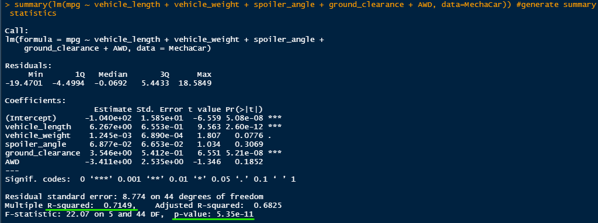
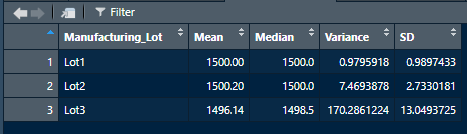
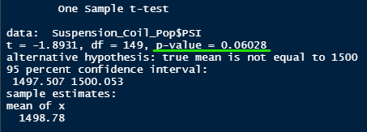
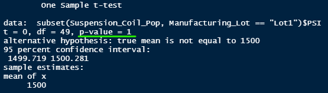
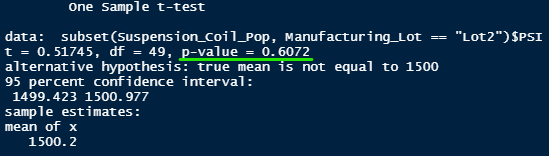
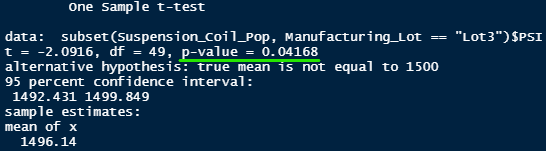

# MechaCar_Statistical_Analysis

## Overview
The purpose of this challenge was to help Jeremy run some analysis, using the software R, for AutosRUs on its new prototype. The analysis consist of multiple linear reguression, summary statistics, t-test, and an alternative study vs the competitors. 

### Linear Regression to Predict MPG
| Calculation Result |
| :---: |
|  | 
| **Analysis** |
| *Which variables/coefficients provided a non-random amount of variance to the mpg values in the data set?* The following variables are statistically likely to provide random amount of variance to the model: AWD, vehicle weight, and spoiler angle. On the other hand, vehicle weight and ground clearance WILL have a significant impact on the data.  
*Is the slope of the linear model considered to be zero? Why or why not?* Since the intercept is significant, the slope of the linear model is considred to NOT be zero. This means there is enough evidence to reject the **null hypothesis**.
*Does this linear model predict mpg of MechaCar prototypes effectively? Why or why not?* Based on our calculation of R-squared, we got a result of 0.7149. This means that the linear regression model was able to explain 71.49% of the data we have. Althought not prefect, we can conclude that this model have a strong correlation and DOES predict mpg of MechaCar protopytes effectively. 

### Summary Statistics on Suspension Coils
| Total Summary & Lot Summary |
| :---: |
|   |
| **Analysis** |
| *The design specifications for the MechaCar suspension coils dictate that the variance of the suspension coils must not exceed 100 pounds per square inch. Does the current manufacturing data meet this design specification for all manufacturing lots in total and each lot individually? Why or why not?* Based on the calculated data for the total summary, the variance DOES fall within the allocated 100 PSI range. The total summary data indicates that the variance is 62.29. When looking at individual lots, Lot3 is out of this range with a varience of 170.29. Lot1 and Lot2 are well within range having variances of 0.98 and 7.47 respectfully. 

### T-Tests on Suspension Coils
| T-test Results | Analysis |
| :---: | :---: |
|  | P-value = 0.06028 indicates that the data is not statiscally significant and we should NOT reject the null hypothesis |
|  | P=value = 1 indicates that lot 1 is not different from the mean population and we should NOT reject the null hypothesis |
|  | P=value = 0.6072 indicates that lot 2 is not different from the mean population and we should NOT reject the null hypothesis |
|  | P=value = 0.04168 indicates that lot 3 IS different from the mean population and we SHOULD reject the null hypothesis. As the data showed us, Lot 3 is not within the norm and more data need to be collected or inspection needs to be done. |

### Study Design: MechaCar vs Competition
Consumers are always looking for vehicles that will keep them safe. But, within the past few years gas prices have skyrocketed and this is a concern to many consumers looking to buy cars. A study that will align with what consumers are looking for would be to compare fuel efficiency, across city and highway, as well as safety ratings. Here are what the test would look like that the metrics to be collected:

- **Metrics:** We will be testing MechaCar's safest vehicle for fuel efficiency.
- **Null Hypothesis:** The highest safety rating cars are the most fuel efficient.
- **Alternate Hypothesis:** The higest saftey rating cars are not the most fuel efficient.
- **Statistical Test:** We will be using a one-sample t-test for this purpose. The one sample t-test will determine whether the sample mean of fuel efficiency is statistically different from the hypothesize population mean.
- **Data to collect:** City MPG & Highway MPG for the higest safety rating vehicles.

If the test goes well and the data was able to support the null hypothesis, then MechaCar can state that their safest vehicles are also the most fuel efficient; this would be a win for MechaCar and consumer choice.

## Summary
Overall, this challenge dives into the root of why statiscal testing is so important. Not only does running the data and getting the results important, it is also important to interpret the results as well. With using the R program, statistical testing can be done much faster and cleaner.

